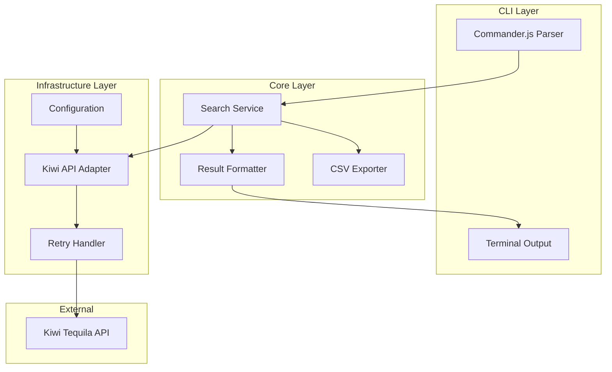
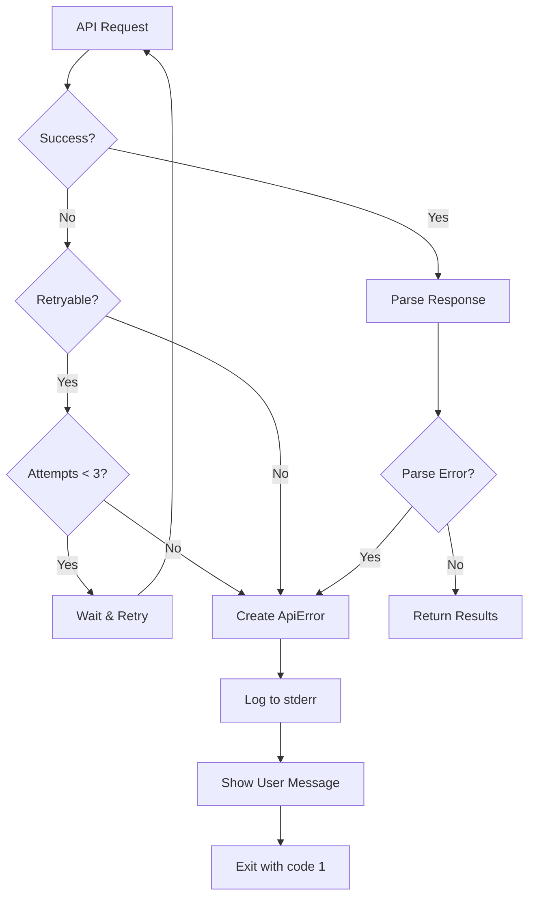

# Technical Design Document: Cheap Flight Finder

## Overview

The Cheap Flight Finder is a Node.js command-line application that discovers low-cost flights from Chicago airports (ORD/MDW) to any US destination using the Kiwi Tequila API. The app answers "where can I fly cheaply?" by searching an entire country in a single API call, filtering by price, and presenting results in a formatted terminal table.

### Technology Stack

| Component | Choice | Rationale |
|-----------|--------|-----------|
| Runtime | Node.js 18+ | TypeScript support, excellent CLI tooling, async/await for API calls |
| Language | TypeScript | Type safety, better IDE support, catches errors at compile time |
| CLI Framework | Commander.js | Industry standard, declarative option parsing, auto-generated help |
| HTTP Client | Axios | Promise-based, automatic retries, interceptors for auth headers |
| Table Formatting | cli-table3 | Unicode box drawing, column alignment, color support |
| Date Handling | date-fns | Lightweight, immutable, tree-shakeable |
| CSV Export | csv-stringify | Streaming, handles escaping correctly |
| Testing | Vitest + fast-check | Fast, ESM-native, property-based testing support |

### Goals

- Provide a fast, reliable CLI for discovering cheap flights from Chicago
- Make a single API call per airport to search all US destinations (not 500 individual calls)
- Present results in a scannable, terminal-friendly format
- Support both one-way and round-trip searches
- Handle API errors gracefully with retries and clear messages

### Non-Goals

- Building a web interface (CLI only for v1)
- Booking flights directly (redirect to Kiwi)
- Price alerts or notifications
- International destinations
- Multi-city itineraries

## Architecture

The application follows a layered architecture with clear separation between CLI parsing, business logic, and external API communication.



### Component Responsibilities

| Component | File | Responsibility |
|-----------|------|----------------|
| CLI Entry | `src/cli.ts` | Parse arguments, invoke search, handle errors |
| Search Service | `src/services/search.ts` | Orchestrate searches, merge results from multiple airports |
| Kiwi Adapter | `src/adapters/kiwi.ts` | Format requests, parse responses, handle API specifics |
| Retry Handler | `src/utils/retry.ts` | Exponential backoff, retry logic |
| Result Formatter | `src/formatters/table.ts` | Format results as terminal table |
| CSV Exporter | `src/formatters/csv.ts` | Generate CSV output |
| Config | `src/config.ts` | Load API key, defaults |
| Types | `src/types.ts` | Shared TypeScript interfaces |

## Kiwi Tequila API Integration

### Getting Your API Key (Free)

**Signup Process:**
1. Go to https://tequila.kiwi.com/portal/login
2. Click "Register" and create a free account
3. Verify your email
4. Navigate to "API Keys" section in the portal
5. Create a new API key (instant, no approval required for search API)

**Important Notes:**
- Search API access is free and instant (no traffic requirements)
- The 50,000 MAU requirement is for the Travelpayouts affiliate program (a different integration), NOT for direct Tequila API access
- Rate limit: ~100 requests per minute on free tier
- Production booking requires commercial agreement (we only use search, not booking)

### Key API Features Used

The Kiwi Tequila API supports searching to a **country code** (e.g., `fly_to=US`), which returns flights to all airports in that country. This is the key insight that makes "search everywhere" practical.

**Verified from documentation:**
- `fly_from` accepts: airport codes, city IDs, **two letter country codes**, metropolitan codes, radiuses
- Example from docs: `'UK' — flights from the United Kingdom`
- The same format applies to `fly_to`
- We use `fly_to=US` to search all US destinations in ONE API call

### API Endpoint

```
GET https://tequila-api.kiwi.com/v2/search
```

### Request Parameters

| Parameter | Type | Description | Our Usage |
|-----------|------|-------------|-----------|
| `fly_from` | string | Origin airport IATA code | "ORD" or "MDW" |
| `fly_to` | string | Destination (airport, city, or country code) | "US" for all US airports |
| `date_from` | string | Start of date range (DD/MM/YYYY) | User-specified or default |
| `date_to` | string | End of date range (DD/MM/YYYY) | User-specified or default |
| `flight_type` | string | "oneway" or "round" | Based on --round-trip flag |
| `nights_in_dst_from` | number | Min nights at destination (round-trip) | From --return-days |
| `nights_in_dst_to` | number | Max nights at destination (round-trip) | From --return-days |
| `price_to` | number | Max price filter | $100 one-way, $200 round-trip |
| `curr` | string | Currency code | "USD" |
| `max_stopovers` | number | Max layovers (0 = nonstop) | From --nonstop flag |
| `limit` | number | Max results | 200 (we filter client-side) |
| `sort` | string | Sort order | "price" |

### Response Structure (Relevant Fields)

```typescript
interface KiwiSearchResponse {
  data: KiwiFlight[];
  currency: string;
  _results: number;
}

interface KiwiFlight {
  id: string;
  price: number;
  deep_link: string;           // Booking URL
  flyFrom: string;             // Origin IATA
  flyTo: string;               // Destination IATA
  cityFrom: string;            // Origin city name
  cityTo: string;              // Destination city name
  local_departure: string;     // ISO datetime
  local_arrival: string;       // ISO datetime
  duration: {
    departure: number;         // Outbound duration in seconds
    return: number;            // Return duration in seconds (round-trip)
    total: number;             // Total duration in seconds
  };
  airlines: string[];          // Array of airline IATA codes
  route: KiwiRouteSegment[];   // Individual flight segments
  availability: {
    seats: number | null;
  };
}

interface KiwiRouteSegment {
  flyFrom: string;
  flyTo: string;
  local_departure: string;
  local_arrival: string;
  airline: string;
  flight_no: number;
  operating_carrier: string;
}
```

### Example API Request

```bash
curl -X GET "https://tequila-api.kiwi.com/v2/search?\
fly_from=ORD&\
fly_to=US&\
date_from=15/03/2024&\
date_to=22/03/2024&\
flight_type=oneway&\
price_to=100&\
curr=USD&\
sort=price&\
limit=200" \
-H "apikey: YOUR_API_KEY"
```

## Components and Interfaces

### CLI Module

```typescript
// src/cli.ts
import { Command } from 'commander';

interface CLIOptions {
  from: 'ORD' | 'MDW' | 'BOTH';
  date?: string;
  dateFrom?: string;
  dateTo?: string;
  roundTrip: boolean;
  returnDays?: string;
  nonstop: boolean;
  airline?: string;
  maxPrice?: number;
  destination?: string;
  limit: number;
  showLinks: boolean;
  open?: number;
  export?: string;
  apiKey?: string;
}

function parseArgs(): CLIOptions;
function validateOptions(options: CLIOptions): ValidationResult;
async function main(): Promise<void>;
```

### Search Service

```typescript
// src/services/search.ts

interface SearchParams {
  origins: OriginAirport[];
  destination: string;  // 'US' or specific airport code
  dateFrom: Date;
  dateTo: Date;
  tripType: 'oneway' | 'round';
  returnDaysMin?: number;
  returnDaysMax?: number;
  maxPrice: number;
  nonstopOnly: boolean;
  airlineFilter?: string[];
  limit: number;
}

interface SearchResult {
  flights: FlightResult[];
  searchParams: SearchParams;
  apiCallCount: number;
  totalResultsFromApi: number;
}

interface ISearchService {
  /**
   * Execute flight search across specified origins
   * Makes parallel API calls if multiple origins, merges and sorts results
   */
  search(params: SearchParams): Promise<SearchResult>;
}
```

### Kiwi API Adapter

```typescript
// src/adapters/kiwi.ts

interface KiwiSearchRequest {
  fly_from: string;
  fly_to: string;
  date_from: string;  // DD/MM/YYYY
  date_to: string;    // DD/MM/YYYY
  flight_type: 'oneway' | 'round';
  nights_in_dst_from?: number;
  nights_in_dst_to?: number;
  price_to: number;
  curr: 'USD';
  max_stopovers?: number;
  limit: number;
  sort: 'price';
}

interface IKiwiAdapter {
  /**
   * Search flights via Kiwi API
   * Handles date formatting, response parsing, and error mapping
   */
  searchFlights(request: KiwiSearchRequest): Promise<KiwiFlight[]>;
}

class KiwiAdapter implements IKiwiAdapter {
  constructor(
    private apiKey: string,
    private retryHandler: IRetryHandler
  ) {}
  
  async searchFlights(request: KiwiSearchRequest): Promise<KiwiFlight[]> {
    const response = await this.retryHandler.withRetry(
      () => this.makeRequest(request),
      { maxAttempts: 3, baseDelayMs: 1000 }
    );
    return this.parseResponse(response);
  }
}
```

### Retry Handler

```typescript
// src/utils/retry.ts

interface RetryConfig {
  maxAttempts: number;
  baseDelayMs: number;
  backoffMultiplier: number;
  retryableStatusCodes: number[];
}

interface IRetryHandler {
  /**
   * Execute operation with exponential backoff retry
   * @throws after maxAttempts failures
   */
  withRetry<T>(
    operation: () => Promise<T>,
    config?: Partial<RetryConfig>
  ): Promise<T>;
}

const DEFAULT_RETRY_CONFIG: RetryConfig = {
  maxAttempts: 3,
  baseDelayMs: 1000,
  backoffMultiplier: 2,
  retryableStatusCodes: [408, 429, 500, 502, 503, 504]
};
```

### Result Formatter

```typescript
// src/formatters/table.ts

interface IResultFormatter {
  /**
   * Format flight results as terminal table
   */
  formatTable(results: FlightResult[], options: FormatOptions): string;
  
  /**
   * Format single flight for display
   */
  formatFlight(flight: FlightResult): TableRow;
  
  /**
   * Format summary line (e.g., "Found 15 flights from $47 to $98")
   */
  formatSummary(results: FlightResult[], params: SearchParams): string;
}

interface FormatOptions {
  showLinks: boolean;
  isRoundTrip: boolean;
}
```

### CSV Exporter

```typescript
// src/formatters/csv.ts

interface IExportService {
  /**
   * Export results to CSV file
   * @returns number of rows written
   */
  exportToCsv(
    results: FlightResult[],
    filePath: string,
    params: SearchParams
  ): Promise<number>;
}
```

## Data Models

### FlightResult (Internal)

```typescript
// src/types.ts

type OriginAirport = 'ORD' | 'MDW';

interface FlightResult {
  id: string;
  price: number;
  origin: OriginAirport;
  destination: string;          // IATA code
  destinationCity: string;      // City name for display
  departureDate: Date;
  departureTime: string;        // HH:mm format
  arrivalTime: string;          // HH:mm format
  durationMinutes: number;
  stops: number;
  airlines: string[];           // Airline codes
  bookingUrl: string;
  
  // Round-trip specific
  returnDepartureDate?: Date;
  returnDepartureTime?: string;
  returnArrivalTime?: string;
  returnDurationMinutes?: number;
  returnStops?: number;
}
```

### Configuration

```typescript
// src/config.ts

interface AppConfig {
  kiwiApiKey: string;
  kiwiBaseUrl: string;
  defaultMaxPriceOneway: number;
  defaultMaxPriceRoundtrip: number;
  defaultDateRangeDays: number;
  defaultReturnDaysMin: number;
  defaultReturnDaysMax: number;
  defaultLimit: number;
  requestTimeoutMs: number;
}

const DEFAULT_CONFIG: Omit<AppConfig, 'kiwiApiKey'> = {
  kiwiBaseUrl: 'https://tequila-api.kiwi.com',
  defaultMaxPriceOneway: 100,
  defaultMaxPriceRoundtrip: 200,
  defaultDateRangeDays: 30,
  defaultReturnDaysMin: 2,
  defaultReturnDaysMax: 7,
  defaultLimit: 20,
  requestTimeoutMs: 30000
};

function loadConfig(): AppConfig {
  const apiKey = process.env.KIWI_API_KEY;
  if (!apiKey) {
    throw new ConfigError(
      'KIWI_API_KEY environment variable not set. ' +
      'Get a free key at https://tequila.kiwi.com'
    );
  }
  return { ...DEFAULT_CONFIG, kiwiApiKey: apiKey };
}
```

## Error Handling

### Error Types

```typescript
// src/errors.ts

class AppError extends Error {
  constructor(
    message: string,
    public readonly exitCode: number,
    public readonly isUserFacing: boolean = true
  ) {
    super(message);
  }
}

class ConfigError extends AppError {
  constructor(message: string) {
    super(message, 1);
  }
}

class ValidationError extends AppError {
  constructor(message: string) {
    super(`Error: ${message}`, 1);
  }
}

class ApiError extends AppError {
  constructor(
    message: string,
    public readonly statusCode?: number,
    public readonly originalError?: Error
  ) {
    super(message, 1);
  }
}
```

### Error Mapping

| HTTP Status | Error Message | Exit Code |
|-------------|---------------|-----------|
| 401 | "Invalid API key. Check your KIWI_API_KEY environment variable" | 1 |
| 429 | "API rate limit exceeded. Please wait a few minutes and try again" | 1 |
| 408, 504 | Retry up to 3 times, then "Unable to connect to flight data service" | 1 |
| 5xx | "Flight data service temporarily unavailable. Try again later" | 1 |
| Network error | "Unable to connect. Check your internet connection" | 1 |

### Error Flow



## Correctness Properties

### Property 1: Price Filter Accuracy

*For any* price threshold value P and *for any* set of flights returned by the search, *all* flights in the result SHALL have price < P, and the result SHALL include *all* flights from the API response that satisfy price < P.

**Validates: Requirements 1.2, 2.2, 5.3**

### Property 2: Origin Airport Correctness

*For any* origin selection (ORD, MDW, or BOTH), the search SHALL query exactly those airports and no others. When BOTH is selected, results SHALL be the union of ORD and MDW results.

**Validates: Requirements 1.3, 1.4**

### Property 3: Date Range Boundary Inclusion

*For any* date range [start, end], the API request SHALL include exactly those boundary dates, and all results SHALL have departure dates within [start, end] inclusive.

**Validates: Requirements 3.1, 3.2**

### Property 4: Past Date Rejection

*For any* date D where D < today, the validation SHALL reject the search and return an error before any API call is made.

**Validates: Requirements 3.4**

### Property 5: Results Sorted by Price

*For any* non-empty result set, for all consecutive pairs (results[i], results[i+1]), results[i].price ≤ results[i+1].price.

**Validates: Requirements 4.8**

### Property 6: Nonstop Filter Completeness

*For any* result set when --nonstop flag is set, *all* flights SHALL have stops === 0.

**Validates: Requirements 5.1**

### Property 7: Airline Filter Correctness

*For any* set of airline codes A and *for any* flight in filtered results, at least one airline in flight.airlines SHALL be in A.

**Validates: Requirements 5.2**

### Property 8: Round-Trip Return Window

*For any* round-trip search with return window [min, max] days, *all* results SHALL have (returnDate - departureDate) in [min, max] inclusive.

**Validates: Requirements 2.3, 2.4**

### Property 9: Export Row Count

*For any* export operation, the CSV file SHALL contain exactly (N + 1) rows where N is the number of flight results (1 header + N data rows).

**Validates: Requirements 10.2**

### Property 10: Limit Enforcement

*For any* --limit N, the displayed results SHALL contain at most N flights.

**Validates: Requirements 5.4**

### Property 11: API Key Never Logged

*For any* execution (success or failure), the API key value SHALL NOT appear in stdout, stderr, or any log output.

**Validates: Requirements 9.4**

### Property 12: Retry Backoff Timing

*For any* retryable failure, the delay before retry attempt K (1-indexed) SHALL be baseDelay * (2^(K-1)) milliseconds (exponential backoff).

**Validates: Requirements 7.3**

### Property 13: Exit Code Consistency

*For any* validation error or API error, exit code SHALL be 1. *For any* successful execution (including zero results), exit code SHALL be 0.

**Validates: Requirements 3.4, 3.5, 6.3, 7.1, 7.2, 7.3, 7.4**

## Testing Strategy

### Test Structure

```
tests/
├── unit/
│   ├── search.test.ts      # SearchService unit tests
│   ├── kiwi-adapter.test.ts # KiwiAdapter unit tests
│   ├── formatter.test.ts    # Table/CSV formatter tests
│   ├── retry.test.ts        # Retry handler tests
│   └── validation.test.ts   # CLI validation tests
├── property/
│   ├── price-filter.property.ts
│   ├── date-range.property.ts
│   ├── sort-order.property.ts
│   ├── airline-filter.property.ts
│   └── export.property.ts
├── integration/
│   ├── cli.integration.ts   # End-to-end CLI tests
│   └── api.integration.ts   # Real API tests (rate-limited)
└── fixtures/
    └── kiwi-responses.ts    # Mock API responses
```

### Property Test Generators

```typescript
// tests/generators.ts
import fc from 'fast-check';

export const flightResultArb = fc.record({
  id: fc.uuid(),
  price: fc.integer({ min: 1, max: 500 }),
  origin: fc.constantFrom('ORD', 'MDW') as fc.Arbitrary<OriginAirport>,
  destination: fc.stringMatching(/^[A-Z]{3}$/),
  destinationCity: fc.string({ minLength: 2, maxLength: 50 }),
  departureDate: fc.date({
    min: new Date(),
    max: new Date(Date.now() + 365 * 24 * 60 * 60 * 1000)
  }),
  departureTime: fc.stringMatching(/^([01]\d|2[0-3]):[0-5]\d$/),
  arrivalTime: fc.stringMatching(/^([01]\d|2[0-3]):[0-5]\d$/),
  durationMinutes: fc.integer({ min: 60, max: 600 }),
  stops: fc.integer({ min: 0, max: 3 }),
  airlines: fc.array(
    fc.stringMatching(/^[A-Z0-9]{2}$/),
    { minLength: 1, maxLength: 3 }
  ),
  bookingUrl: fc.webUrl()
});

export const searchParamsArb = fc.record({
  origins: fc.array(
    fc.constantFrom('ORD', 'MDW') as fc.Arbitrary<OriginAirport>,
    { minLength: 1, maxLength: 2 }
  ),
  destination: fc.constantFrom('US', 'LAX', 'JFK', 'MIA'),
  dateFrom: fc.date({ min: new Date() }),
  dateTo: fc.date({ min: new Date() }),
  tripType: fc.constantFrom('oneway', 'round') as fc.Arbitrary<'oneway' | 'round'>,
  maxPrice: fc.integer({ min: 1, max: 500 }),
  nonstopOnly: fc.boolean(),
  limit: fc.integer({ min: 1, max: 100 })
});

export const priceThresholdArb = fc.integer({ min: 10, max: 300 });
```

### Example Property Test

```typescript
// tests/property/price-filter.property.ts
import { describe, it, expect } from 'vitest';
import fc from 'fast-check';
import { filterByPrice } from '../../src/services/search';
import { flightResultArb, priceThresholdArb } from '../generators';

describe('Feature: cheap-flight-finder, Property 1: Price Filter Accuracy', () => {
  it('should include only flights below threshold', () => {
    fc.assert(
      fc.property(
        fc.array(flightResultArb, { minLength: 0, maxLength: 100 }),
        priceThresholdArb,
        (flights, threshold) => {
          const filtered = filterByPrice(flights, threshold);
          
          // All results must be under threshold
          const allUnderThreshold = filtered.every(f => f.price < threshold);
          
          // All flights under threshold must be included
          const expectedCount = flights.filter(f => f.price < threshold).length;
          const correctCount = filtered.length === expectedCount;
          
          return allUnderThreshold && correctCount;
        }
      ),
      { numRuns: 100, seed: Date.now() }
    );
  });
});
```

### Coverage Goals

| Category | Target |
|----------|--------|
| Unit test line coverage | ≥ 85% |
| Property tests | All 13 properties |
| Integration tests | CLI happy path, error paths, API retry |
| Manual testing | Real API calls with valid key |

## Project Structure

```
cheap-flight-finder/
├── src/
│   ├── cli.ts              # Entry point, argument parsing
│   ├── config.ts           # Configuration loading
│   ├── types.ts            # Shared TypeScript interfaces
│   ├── errors.ts           # Custom error classes
│   ├── services/
│   │   └── search.ts       # Search orchestration
│   ├── adapters/
│   │   └── kiwi.ts         # Kiwi API client
│   ├── formatters/
│   │   ├── table.ts        # Terminal table output
│   │   └── csv.ts          # CSV export
│   └── utils/
│       ├── retry.ts        # Retry with backoff
│       ├── dates.ts        # Date formatting utilities
│       └── browser.ts      # Open URL in browser
├── tests/
│   ├── unit/
│   ├── property/
│   ├── integration/
│   └── fixtures/
├── package.json
├── tsconfig.json
├── vitest.config.ts
└── README.md
```

## Dependencies

```json
{
  "dependencies": {
    "axios": "^1.6.0",
    "commander": "^12.0.0",
    "cli-table3": "^0.6.3",
    "date-fns": "^3.3.0",
    "csv-stringify": "^6.4.0",
    "open": "^10.0.0"
  },
  "devDependencies": {
    "typescript": "^5.3.0",
    "@types/node": "^20.0.0",
    "vitest": "^1.2.0",
    "fast-check": "^3.15.0",
    "nock": "^13.5.0"
  }
}
```

## API Rate Limiting & Caching Considerations

### Rate Limits

The Kiwi Tequila API free tier has the following limits:
- 100 requests per minute
- No daily limit specified

For our use case (1-2 requests per search), this is more than sufficient.

### Caching Strategy (Future Enhancement)

For v1, we don't implement caching. For future versions:
- Cache API responses for 15 minutes (prices change frequently)
- Use file-based cache in `~/.cache/cheap-flights/`
- Cache key: hash of (origin, destination, dateFrom, dateTo, tripType, maxPrice)

## Sequence Diagram: Search Flow

```mermaid
sequenceDiagram
    participant User
    participant CLI
    participant Search
    participant Kiwi
    participant Formatter
    
    User->>CLI: cheap-flights --from ORD --nonstop
    CLI->>CLI: Parse & validate args
    CLI->>Search: search(params)
    
    Search->>Kiwi: searchFlights(ORD → US)
    Kiwi->>Kiwi: Format request
    Kiwi-->>Search: KiwiFlight[]
    
    Search->>Search: Transform to FlightResult[]
    Search->>Search: Sort by price
    Search->>Search: Apply limit
    Search-->>CLI: SearchResult
    
    CLI->>Formatter: formatTable(results)
    Formatter-->>CLI: formatted string
    CLI-->>User: Display table
```



## Sample Output

```
$ cheap-flights --from ORD --nonstop --date-from 2024-03-15 --date-to 2024-03-22

Found 12 flights from $47 to $94

┌───────┬───────────┬────────┬─────────┬──────────┬─────────┬─────────┐
│ Price │ Route     │ Date   │ Time    │ Airline  │ Duration│ Stops   │
├───────┼───────────┼────────┼─────────┼──────────┼─────────┼─────────┤
│ $47   │ ORD → LAS │ Mar 17 │ 6:30am  │ Spirit   │ 3h 45m  │ Nonstop │
│ $53   │ ORD → DEN │ Mar 18 │ 7:15am  │ Frontier │ 2h 30m  │ Nonstop │
│ $58   │ ORD → LAX │ Mar 15 │ 9:00am  │ Spirit   │ 4h 10m  │ Nonstop │
│ $62   │ ORD → PHX │ Mar 20 │ 8:45am  │ Frontier │ 3h 20m  │ Nonstop │
│ $67   │ ORD → MIA │ Mar 16 │ 6:00am  │ Spirit   │ 3h 05m  │ Nonstop │
│ ...   │ ...       │ ...    │ ...     │ ...      │ ...     │ ...     │
└───────┴───────────┴────────┴─────────┴──────────┴─────────┴─────────┘

Note: Prices may differ on booking site

$ cheap-flights --round-trip --return-days 3-5 --max-price 150

Found 8 round-trip flights from $89 to $147

┌───────┬───────────┬────────┬─────────┬──────────┬─────────┬─────────┐
│ Price │ Route     │ Date   │ Time    │ Airline  │ Duration│ Stops   │
├───────┼───────────┼────────┼─────────┼──────────┼─────────┼─────────┤
│ $89   │ MDW → LAS │ Mar 17 │ 7:00am  │ Southwest│ 3h 40m  │ Nonstop │
│       │ LAS → MDW │ Mar 20 │ 4:30pm  │ Southwest│ 3h 25m  │ Nonstop │
├───────┼───────────┼────────┼─────────┼──────────┼─────────┼─────────┤
│ $103  │ ORD → DEN │ Mar 18 │ 6:45am  │ United   │ 2h 35m  │ Nonstop │
│       │ DEN → ORD │ Mar 22 │ 5:00pm  │ United   │ 2h 40m  │ Nonstop │
└───────┴───────────┴────────┴─────────┴──────────┴─────────┴─────────┘
```

## First-Time Setup Guide

### Quick Start (5 minutes)

```bash
# 1. Get your free API key
#    - Go to https://tequila.kiwi.com/portal/login
#    - Register (instant, no approval needed)
#    - Create an API key in the portal

# 2. Set your API key
export KIWI_API_KEY="your-api-key-here"

# 3. Install the CLI (after building)
npm install -g cheap-flight-finder

# 4. Search for deals!
cheap-flights --from ORD --nonstop
```

### Verify Setup

```bash
# Test that your API key works
cheap-flights --help  # Should show help without API key
cheap-flights         # Will error if KIWI_API_KEY not set
```

### Troubleshooting

| Error | Cause | Solution |
|-------|-------|----------|
| "KIWI_API_KEY not set" | Environment variable missing | `export KIWI_API_KEY="your-key"` |
| "Invalid API key" | Key is malformed or expired | Regenerate key in Tequila portal |
| "Rate limit exceeded" | Too many requests | Wait 1 minute, consider caching |
| "Unable to connect" | Network issue | Check internet connection |
