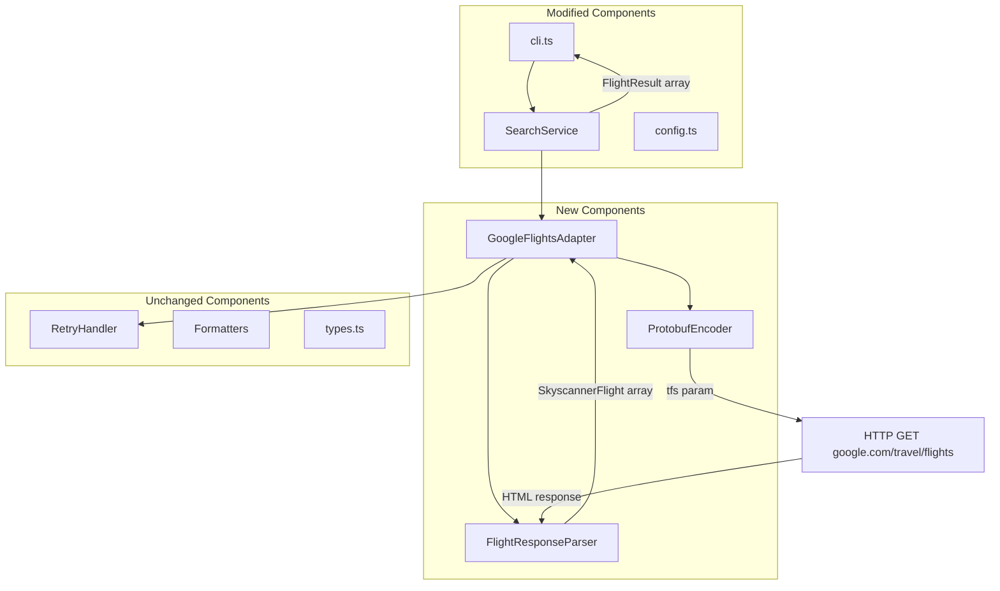

# Design Document: Google Flights Scraper

## Overview

This design replaces the existing RapidAPI-based Skyscanner adapter with a direct Google Flights scraping adapter. The new `GoogleFlightsAdapter` constructs Protobuf-encoded Base64 query strings (the `tfs` URL parameter), fetches results via HTTP GET, and parses flight data from embedded JavaScript arrays (`AF_initDataCallback` payloads) in the response. This eliminates the paid API key dependency while maintaining full compatibility with the existing `IFlightAdapter` interface.

The design also extends the CLI with new filter options (seat class, passenger count, departure time window, max duration, basic economy exclusion) and updates the configuration module to remove API key requirements.

### Key Design Decisions

1. **Manual Protobuf buffer construction** over `protobufjs` library — the Google Flights `tfs` parameter uses a relatively simple, reverse-engineered Protobuf schema with known field numbers. Manual construction avoids a heavy dependency and gives precise control over the wire format.
2. **JavaScript data extraction** over HTML DOM parsing — Google Flights embeds flight data in `AF_initDataCallback` JavaScript calls as nested arrays. Regex-based extraction of these JSON-like structures is more reliable than parsing rendered HTML.
3. **Drop-in adapter replacement** — the new adapter implements `IFlightAdapter` with identical method signatures, requiring no changes to the search service or formatters.
4. **Client-side filtering for new options** — departure time window, max duration, and basic economy exclusion are applied as post-processing filters in the search service, keeping the adapter focused on data fetching.

## Architecture



### Data Flow

1. CLI parses arguments including new options (`--seat`, `--adults`, `--departure-after`, `--departure-before`, `--max-duration`, `--exclude-basic-economy`)
2. `SearchService` transforms `SearchParams` to `SkyscannerSearchRequest` (extended with new fields)
3. `GoogleFlightsAdapter.searchFlights()` is called:
   a. `ProtobufEncoder` encodes request into `tfs` Base64 string
   b. HTTP GET request to `https://www.google.com/travel/flights?tfs={encoded}&curr=USD&hl=en`
   c. `FlightResponseParser` extracts flight data from `AF_initDataCallback` in response body
   d. Results mapped to `SkyscannerFlight[]`
4. `SearchService` applies client-side filters (departure time, max duration, basic economy) and returns `FlightResult[]`

## Components and Interfaces

### 1. ProtobufEncoder (`src/adapters/google-flights/protobuf-encoder.ts`)

Responsible for constructing the Protobuf-encoded, Base64 `tfs` URL parameter.

```typescript
/**
 * Encodes flight search parameters into the Google Flights tfs URL parameter.
 * Uses manual Protobuf wire format construction (varint + length-delimited fields).
 */
export interface IProtobufEncoder {
  /**
   * Encode search parameters into a URL-safe Base64 string for the tfs parameter.
   */
  encode(params: GoogleFlightsQueryParams): string;

  /**
   * Decode a tfs parameter back into search parameters (for testing/validation).
   */
  decode(tfs: string): GoogleFlightsQueryParams;
}

export interface GoogleFlightsQueryParams {
  /** Origin airport IATA code (e.g., "ORD") */
  origin: string;
  /** Destination airport IATA code (e.g., "LAX"), or empty for "everywhere" */
  destination: string;
  /** Departure date in YYYY-MM-DD format */
  departureDate: string;
  /** Return date in YYYY-MM-DD format (round-trip only) */
  returnDate?: string;
  /** Trip type: 1 = round-trip, 2 = one-way */
  tripType: 1 | 2;
  /** Seat class: 1 = economy, 2 = premium economy, 3 = business, 4 = first */
  seatClass: 1 | 2 | 3 | 4;
  /** Number of adult passengers (1-9) */
  adults: number;
}
```

**Protobuf Wire Format Strategy:**

The `tfs` parameter uses a nested Protobuf message structure. Based on reverse-engineering of Google Flights URLs, the approximate schema is:

```
message FlightSearch {
  repeated FlightLeg legs = 1;    // One leg for one-way, two for round-trip
  int32 passengers = 2;           // Adult count
  int32 seat_class = 3;           // 1=economy, 2=premium, 3=business, 4=first
  int32 trip_type = 4;            // 1=round-trip, 2=one-way
}

message FlightLeg {
  string origin = 1;              // IATA code
  string destination = 2;         // IATA code
  FlightDate date = 3;            // Departure date
}

message FlightDate {
  int32 year = 1;
  int32 month = 2;
  int32 day = 3;
}
```

The encoder uses low-level Buffer operations:
- **Varint encoding** for integer fields (wire type 0)
- **Length-delimited encoding** for strings and sub-messages (wire type 2)
- **URL-safe Base64** encoding of the final buffer (replace `+` → `-`, `/` → `_`, remove `=` padding)

### 2. FlightResponseParser (`src/adapters/google-flights/response-parser.ts`)

Extracts flight data from the Google Flights HTML response.

```typescript
/**
 * Parses Google Flights response HTML to extract flight data.
 * Targets AF_initDataCallback JavaScript payloads containing nested arrays.
 */
export interface IFlightResponseParser {
  /**
   * Parse the response body and extract flight results.
   * Returns empty array if no flight data can be extracted.
   */
  parse(responseBody: string): ParsedFlight[];
}

export interface ParsedFlight {
  price: number;
  currency: string;
  origin: string;
  destination: string;
  departureTime: string;  // ISO 8601
  arrivalTime: string;    // ISO 8601
  durationMinutes: number;
  stops: number;
  airlines: string[];
  flightNumbers: string[];
  segments: ParsedSegment[];
  isBasicEconomy: boolean;
  bookingToken?: string;
}

export interface ParsedSegment {
  origin: string;
  destination: string;
  departureTime: string;
  arrivalTime: string;
  airline: string;
  flightNumber: string;
  durationMinutes: number;
}
```

**Parsing Strategy:**

1. Extract all `AF_initDataCallback` blocks using regex: `/AF_initDataCallback\(\{[^}]*data:(\[[\s\S]*?\])\s*\}\)/g`
2. Parse each extracted JSON array
3. Navigate the nested array structure to find flight offer data (typically at specific index paths that contain price, airport codes, and timestamps)
4. Map raw array entries to `ParsedFlight` objects
5. Skip entries with missing required fields (price, departure time, destination)
6. Generate booking deep links: `https://www.google.com/travel/flights/booking?tfs={tfs}&curr=USD`

### 3. GoogleFlightsAdapter (`src/adapters/google-flights/adapter.ts`)

The main adapter implementing `IFlightAdapter`.

```typescript
import { IFlightAdapter, SkyscannerSearchRequest, SkyscannerFlight } from '../skyscanner.js';
import { IRetryHandler } from '../../utils/retry.js';

/**
 * Google Flights adapter that scrapes flight data directly.
 * No API key required.
 */
export class GoogleFlightsAdapter implements IFlightAdapter {
  constructor(
    private readonly retryHandler: IRetryHandler,
    private readonly encoder: IProtobufEncoder = new ProtobufEncoder(),
    private readonly parser: IFlightResponseParser = new FlightResponseParser(),
    private readonly requestTimeoutMs: number = 15000
  ) {}

  async searchFlights(request: SkyscannerSearchRequest): Promise<SkyscannerFlight[]> {
    // 1. Map SkyscannerSearchRequest to GoogleFlightsQueryParams
    // 2. Encode to tfs parameter
    // 3. Construct URL and fetch with browser-like headers
    // 4. Parse response
    // 5. Map ParsedFlight[] to SkyscannerFlight[]
    // 6. Apply price filter and limit
  }
}
```

**HTTP Request Configuration:**
- URL: `https://www.google.com/travel/flights?tfs={encoded}&curr=USD&hl=en`
- Method: GET
- Timeout: 15 seconds
- Headers:
  - `User-Agent`: Rotating modern browser UA string
  - `Accept`: `text/html,application/xhtml+xml,application/xml;q=0.9,*/*;q=0.8`
  - `Accept-Language`: `en-US,en;q=0.9`
  - `Accept-Encoding`: `gzip, deflate, br`
  - `Connection`: `keep-alive`
  - `Cache-Control`: `no-cache`

### 4. Extended SearchParams and Request Types

```typescript
// In src/types.ts - extend SearchParams
export interface SearchParams {
  // ... existing fields ...

  /** Seat class for the search */
  seatClass?: 'economy' | 'premium-economy' | 'business' | 'first';
  /** Number of adult passengers */
  adults?: number;
  /** Minimum departure time filter (HH:mm format) */
  departureAfter?: string;
  /** Maximum departure time filter (HH:mm format) */
  departureBefore?: string;
  /** Maximum flight duration in minutes */
  maxDuration?: number;
  /** Exclude basic economy fares */
  excludeBasicEconomy?: boolean;
}

// In src/adapters/skyscanner.ts - extend SkyscannerSearchRequest
export interface SkyscannerSearchRequest {
  // ... existing fields ...

  /** Seat class: 1=economy, 2=premium-economy, 3=business, 4=first */
  seat_class?: number;
  /** Number of adult passengers */
  adults?: number;
}
```

### 5. CLI Extensions (`src/cli.ts`)

New Commander.js options:

```typescript
.option('--seat <CLASS>', 'Cabin class: economy, premium-economy, business, first', 'economy')
.option('--adults <N>', 'Number of adult passengers (1-9)', (v) => parseInt(v, 10), 1)
.option('--departure-after <HH:mm>', 'Only show flights departing after this time')
.option('--departure-before <HH:mm>', 'Only show flights departing before this time')
.option('--max-duration <MINUTES>', 'Maximum flight duration in minutes', (v) => parseInt(v, 10))
.option('--exclude-basic-economy', 'Exclude basic economy fares', false)
```

Remove the `--api-key` option.

### 6. Configuration Changes (`src/config.ts`)

```typescript
export interface AppConfig {
  // Remove: rapidApiKey, kiwiApiKey, kiwiBaseUrl
  // Keep all other fields

  /** Base URL for Google Flights */
  googleFlightsBaseUrl: string;

  /** HTTP request timeout in milliseconds */
  requestTimeoutMs: number;

  // ... existing default fields unchanged ...
}

export function loadConfig(): AppConfig {
  // No API key validation
  // No environment variable requirement
  return {
    googleFlightsBaseUrl: 'https://www.google.com/travel/flights',
    requestTimeoutMs: 15000,
    defaultMaxPriceOneway: 100,
    defaultMaxPriceRoundtrip: 200,
    defaultDateRangeDays: 30,
    defaultReturnDaysMin: 2,
    defaultReturnDaysMax: 7,
    defaultLimit: 20,
  };
}
```

## Data Models

### Google Flights Query Params → Protobuf Binary

| Field | Protobuf Field # | Wire Type | Description |
|-------|-----------------|-----------|-------------|
| legs | 1 | 2 (LEN) | Repeated sub-message for each flight leg |
| leg.origin | 1 | 2 (LEN) | String: IATA airport code |
| leg.destination | 2 | 2 (LEN) | String: IATA airport code |
| leg.date | 3 | 2 (LEN) | Sub-message: year, month, day |
| leg.date.year | 1 | 0 (VARINT) | Integer: 4-digit year |
| leg.date.month | 2 | 0 (VARINT) | Integer: 1-12 |
| leg.date.day | 3 | 0 (VARINT) | Integer: 1-31 |
| passengers | 2 | 0 (VARINT) | Integer: adult count |
| seat_class | 3 | 0 (VARINT) | Integer: 1-4 |
| trip_type | 4 | 0 (VARINT) | Integer: 1=round, 2=one-way |

### ParsedFlight → SkyscannerFlight Mapping

| ParsedFlight | SkyscannerFlight | Transformation |
|-------------|-----------------|----------------|
| origin + destination + departureTime | id | SHA-256 hash of composite key |
| price | price | Direct |
| booking URL | deep_link | Constructed from tfs param |
| origin | flyFrom | Direct |
| destination | flyTo | Direct |
| (city lookup) | cityFrom / cityTo | Lookup table or response data |
| departureTime | local_departure | ISO format |
| arrivalTime | local_arrival | ISO format |
| durationMinutes | duration.departure | × 60 (to seconds) |
| airlines | airlines | Direct |
| segments | route | Map to SkyscannerRouteSegment[] |
| (n/a) | availability.seats | null (not available from Google) |

### Seat Class Mapping

| CLI Value | SearchParams | Protobuf Value |
|-----------|-------------|----------------|
| economy | 'economy' | 1 |
| premium-economy | 'premium-economy' | 2 |
| business | 'business' | 3 |
| first | 'first' | 4 |


## Correctness Properties

*A property is a characteristic or behavior that should hold true across all valid executions of a system — essentially, a formal statement about what the system should do. Properties serve as the bridge between human-readable specifications and machine-verifiable correctness guarantees.*

### Property 1: Protobuf Encoding Round-Trip

*For any* valid `GoogleFlightsQueryParams` (origin as 3-letter IATA code, destination as 3-letter IATA code or empty, departure date as valid future date, optional return date, trip type in {1, 2}, seat class in {1, 2, 3, 4}, adults in 1–9), encoding to a `tfs` Base64 string and then decoding back SHALL produce an equivalent set of parameters.

**Validates: Requirements 1.1, 1.2, 1.3, 1.4, 1.5, 1.6**

### Property 2: Parser Output Shape Validity

*For any* valid Google Flights response body containing flight data in `AF_initDataCallback` format, every element in the parser's output array SHALL have all required `SkyscannerFlight` fields populated (id, price > 0, flyFrom as IATA code, flyTo as IATA code, local_departure as ISO datetime, local_arrival as ISO datetime, duration.departure > 0, airlines as non-empty array, deep_link starting with `https://www.google.com/travel/flights`).

**Validates: Requirements 3.1, 3.2, 3.5**

### Property 3: Parser Skips Incomplete Entries

*For any* array of flight entries where some entries are missing required fields (price, departure time, or destination), the parser SHALL return only the entries that have all required fields, and the count of returned results SHALL equal the count of complete entries in the input.

**Validates: Requirements 3.4**

### Property 4: Departure Time Window Filter

*For any* departure time window defined by `departureAfter` and/or `departureBefore` (both in HH:mm format) and *for any* list of `FlightResult` objects with varying departure times, applying the time filter SHALL return only flights whose departure time is >= `departureAfter` (if set) and <= `departureBefore` (if set), inclusive of boundary values.

**Validates: Requirements 7.1, 7.2, 7.3**

### Property 5: Max Duration Filter

*For any* positive integer `maxDuration` (in minutes) and *for any* list of `FlightResult` objects with varying durations, applying the max-duration filter SHALL return only flights whose `durationMinutes` is less than or equal to `maxDuration`.

**Validates: Requirements 8.1**

### Property 6: Basic Economy Exclusion Filter

*For any* list of `FlightResult` objects where each flight has an `isBasicEconomy` boolean flag, applying the exclude-basic-economy filter SHALL return only flights where `isBasicEconomy` is false, and the count of returned results SHALL equal the count of non-basic-economy flights in the input.

**Validates: Requirements 9.1**

### Property 7: Invalid Adults Rejection

*For any* integer value outside the range [1, 9] (including 0, negative numbers, and values > 9), the adults validator SHALL reject the input and signal an error.

**Validates: Requirements 6.3**

### Property 8: Invalid Time Format Rejection

*For any* string that does not match the pattern `HH:mm` where HH is 00–23 and mm is 00–59, the time format validator SHALL reject the input and signal an error.

**Validates: Requirements 7.4**

## Error Handling

### Error Categories and Responses

| Condition | Detection | Response | Exit Code |
|-----------|-----------|----------|-----------|
| Google blocks request (403) | HTTP status code 403 | Throw `ApiError` with message suggesting waiting before retry | 1 |
| CAPTCHA detected | Response body contains CAPTCHA markers | Throw `ApiError` with "blocked" message | 1 |
| Rate limited (429) | HTTP status 429 | Retry with exponential backoff (1s, 2s, 4s), then throw | 1 |
| Server error (5xx) | HTTP status 500–504 | Retry with exponential backoff, then throw | 1 |
| Request timeout | No response within 15s | Retry, then throw `ApiError` with timeout message | 1 |
| Network failure | DNS/connection error | Throw `ApiError` with cause description | 1 |
| Unrecognized response format | Parser finds no `AF_initDataCallback` data | Return empty array, `console.warn()` to stderr | 0 |
| Invalid CLI input | Validation failure | Throw `ValidationError` with specific message | 1 |
| All retries exhausted | 3 attempts failed | Throw `ApiError` with max retry message | 1 |

### Error Handling Strategy

1. **Retryable errors** (429, 5xx, timeout, network): Delegated to the existing `RetryHandler` with config `{ maxAttempts: 3, baseDelayMs: 1000 }`.
2. **Blocking detection** (403, CAPTCHA): Not retryable — immediately throw with a user-friendly message advising to wait.
3. **Parse failures**: Graceful degradation — return empty results rather than crashing. Log warning to stderr so users know the scraper may need updating.
4. **Input validation**: Fail fast at CLI layer before any network calls.

### CAPTCHA Detection

```typescript
function isCaptchaResponse(body: string): boolean {
  return body.includes('recaptcha') || 
         body.includes('captcha') ||
         body.includes('/sorry/index');
}
```

## Testing Strategy

### Property-Based Tests (fast-check)

The project already uses `fast-check` with `vitest`. Each correctness property maps to a property-based test with minimum 100 iterations.

| Property | Test File | Generator Strategy |
|----------|-----------|-------------------|
| 1: Encoding round-trip | `tests/property/protobuf-roundtrip.property.test.ts` | Random IATA codes (3 uppercase letters), random dates (2024–2026), random seat/trip/adults |
| 2: Parser output shape | `tests/property/parser-output-shape.property.test.ts` | Generate valid nested arrays matching AF_initDataCallback format |
| 3: Parser skips incomplete | `tests/property/parser-incomplete-entries.property.test.ts` | Mix of complete and incomplete flight data arrays |
| 4: Departure time filter | `tests/property/departure-time-filter.property.test.ts` | Random HH:mm times and random FlightResult lists |
| 5: Max duration filter | `tests/property/max-duration-filter.property.test.ts` | Random positive integers and random FlightResult lists |
| 6: Basic economy filter | `tests/property/basic-economy-filter.property.test.ts` | Random FlightResult lists with random isBasicEconomy flags |
| 7: Invalid adults rejection | `tests/property/invalid-adults.property.test.ts` | Random integers outside [1,9] |
| 8: Invalid time rejection | `tests/property/invalid-time-format.property.test.ts` | Random strings not matching HH:mm |

**Configuration:**
- Minimum 100 iterations per property test (fast-check default `numRuns: 100`)
- Each test file tagged with: `// Feature: google-flights-scraper, Property N: {description}`

### Unit Tests (vitest)

| Component | Test Focus |
|-----------|-----------|
| `ProtobufEncoder` | Specific known encodings (ORD→LAX, 2024-06-15, economy, 1 adult) verified against captured real tfs values |
| `FlightResponseParser` | Parse fixture response bodies, verify correct extraction |
| `GoogleFlightsAdapter` | Mock HTTP + parser, verify orchestration flow |
| `config.ts` | loadConfig() succeeds without env vars |
| `cli.ts` | New options parsed correctly, defaults applied, validation errors |
| `SearchService` | New filters (time, duration, basic economy) with specific examples |

### Integration Tests

| Scenario | Approach |
|----------|----------|
| End-to-end CLI with mocked HTTP | Nock intercepts Google Flights requests, verify full pipeline |
| Real Google Flights request | Manual/CI-excluded test that makes a real request (for development validation only) |

### Test Dependencies

- `fast-check` ^3.15.0 (already installed)
- `vitest` ^1.2.0 (already installed)
- `nock` ^13.5.0 (already installed)
- No new test dependencies required
